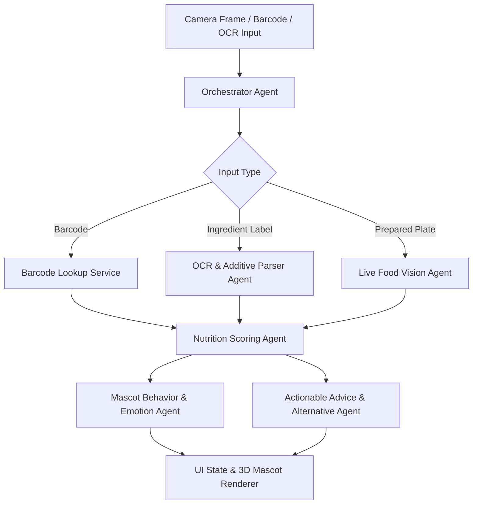

# Agents Architecture & Orchestration Guide (AGENTS.md) — NutriBuddy

**Version:** 1.0.0  
**Scope:** Autonomous System Agents, AI Services, Orchestration Pipelines, and Fallback Engineering  

---

## 1. Overview of the Multi-Agent System

NutriBuddy employs a decoupled, multi-agent architecture designed to provide instant, reliable nutritional intelligence and delightful emotional feedback. Rather than relying on a single monolithic LLM call—which produces high latency, unpredictable schemas, and heavy battery consumption—NutriBuddy splits intelligence into specialized, deterministic worker agents and a generative mascot agent.



---

## 2. Agent Catalog & Responsibilities

### 2.1. Vision AI Agent (`VisionAgent`)
- **Role:** High-speed visual meal decomposition, segmentation, and portion estimation.
- **Input:** Downsampled camera frame (JPEG, 1080x1080, 80% quality) + metadata (plate bounding box, device angle, lighting conditions).
- **Output:** Structured JSON schema containing identified items, bounding boxes, estimated weights (grams), confidence scores, and dietary tags.
- **Model Engine:** Vision-Language Model (Gemini 2.5 Flash / Claude 3.5 Sonnet / On-device CoreML/TFLite YOLO-Food model fallback).
- **Latency Budget:** <= 1,200 ms.

### 2.2. OCR & Ingredient Parsing Agent (`OcrIngredientAgent`)
- **Role:** Extract text from packaging, sanitize optical errors, parse complex nested ingredient trees, identify E-numbers and chemical additives, and detect user allergens.
- **Input:** Raw OCR string or extracted bounding boxes from camera.
- **Output:** Normalized list of ingredients, matched additive records with toxicity grades (1–5), flagged allergens, and NOVA classification confidence.
- **Model Engine:** On-device regex tokenizer + rule-based dictionary engine with fallback to LLM parser for messy/damaged text.
- **Latency Budget:** <= 400 ms (local) / <= 1,000 ms (cloud fallback).

### 2.3. Nutrition Scoring Agent (`ScoringAgent`)
- **Role:** Deterministic calculation of the NutriBuddy Health Index (0–100), macronutrient ratios, caloric density, and ultra-processed food (UPF) penalties.
- **Input:** Structured ingredient list or identified food items with portion sizes.
- **Output:** 
  - `healthScore`: Number (0–100)
  - `grade`: 'A' | 'B' | 'C' | 'D' | 'F'
  - `novaGroup`: 1 | 2 | 3 | 4
  - `positives`: Array of string highlights (e.g., "High fiber", "Whole food")
  - `negatives`: Array of flagged concerns (e.g., "Excessive saturated fat", "Contains E211")
- **Model Engine:** 100% Deterministic Mathematical Engine (Zod-validated TypeScript logic, zero hallucination risk).
- **Latency Budget:** <= 20 ms.

### 2.4. Mascot Behavior & Emotion Agent (`MascotAgent`)
- **Role:** Determines character emotional response, facial blend shapes, skeletal animation triggers, audio soundbite IDs, and concise, personality-rich speech bubble dialogue.
- **Input:** `ScoringAgent` output, user's allergen profile, current time of day, and user relationship history (streaks, past favorites).
- **Output:**
  - `mood`: 'ecstatic' | 'happy' | 'neutral' | 'concerned' | 'alarmed' | 'sleepy'
  - `animationClip`: string identifier (e.g., 'bounce_cheer', 'scratch_head', 'shield_warn')
  - `speechBubbleText`: string (maximum 90 characters, friendly, encouraging, empathetic)
  - `soundEffect`: string ('sfx_cheer_harp', 'sfx_affirm_chime', 'sfx_warn_thud')
- **Model Engine:** Rule-driven state machine for emotion/animation + lightweight prompt-tuned LLM for personalized speech dialogue.
- **Latency Budget:** <= 300 ms.

### 2.5. Product Alternative & Advice Agent (`RecommendationAgent`)
- **Role:** Suggests healthier, cleaner packaged alternatives or culinary modifications for poor-scoring items.
- **Input:** Flagged packaged food or prepared dish + reason for penalty (e.g., "High sodium & BHA").
- **Output:** 2 to 3 practical swap suggestions (e.g., "Swap for Organic Rolled Oats" or "Replace Mayo with Greek Yogurt garlic spread").

---

## 3. System Prompts & Strict Output Schemas

### 3.1. Vision AI Agent System Prompt
```text
You are the NutriBuddy Vision Engine. Analyze the food image accurately and objectively.
Detect every distinct food item visible on the plate or in the container.
For each item:
1. Identify the name of the food item.
2. Estimate the mass in grams based on standard reference portion sizes.
3. Provide approximate Calories, Protein (g), Carbs (g), and Fat (g).
4. Assign a confidence score from 0.00 to 1.00.

Return STRICT JSON complying with this schema:
{
  "items": [
    {
      "name": string,
      "estimatedGrams": number,
      "calories": number,
      "protein": number,
      "carbs": number,
      "fat": number,
      "confidence": number,
      "boundingBox": { "x": number, "y": number, "width": number, "height": number }
    }
  ],
  "totalPlateCalories": number,
  "confidenceOverall": number,
  "culinaryNotes": string
}
Never output markdown fences or explanatory text outside the JSON.
```

### 3.2. Mascot Dialogue System Prompt
```text
You are "Bao", a wise, warm, and playful 3D red panda companion in NutriBuddy.
Your job is to react to the user's food with short, witty, and compassionate advice.
Constraints:
- Maximum 18 words / 90 characters.
- Tone: Joyful when food is nourishing; gently curious or concerned when food has toxic additives or high sugar; never punitive or shame-inducing.
- Never mention numbers, calorie counting, or dieting. Focus on energy, wholesome ingredients, and how the body feels.
- If an allergen is flagged, be protective and firm: "Hold on! That has peanuts in it. Let's keep you safe!"
```

---

## 4. Resilience, Offline Operation & Guardrails

### 4.1. Network Interruption & Offline Fallback
- When no internet connection is detected:
  - **Barcode Scanning:** Queries local SQLite database (`nutribuddy_offline.db`) storing 25,000 common staple barcodes with pre-indexed health scores.
  - **OCR Parsing:** Runs on-device MLKit / Apple Vision OCR + local regex dictionary of 2,500 additives.
  - **Mascot Dialogue:** Selects from a pre-compiled offline dialogue bank of 300+ contextually categorized quips.
  - **Live Food Vision:** Prompts user to save snapshot to local draft queue for automatic background analysis upon network reconnection.

### 4.2. Hallucination Mitigation & Output Validation
- Every model output must pass strict **Zod** runtime schema validation.
- If schema validation fails, the orchestrator triggers an automatic single-retry with a schema correction prompt.
- If the retry fails, the system smoothly falls back to conservative rule-based nutritional estimates without crashing or showing raw error messages to the user.

### 4.3. Privacy and Data Scrubbing
- Images sent to vision APIs are stripped of EXIF data (GPS coordinates, device serial numbers).
- No personally identifiable information (PII) is included in model context windows.
