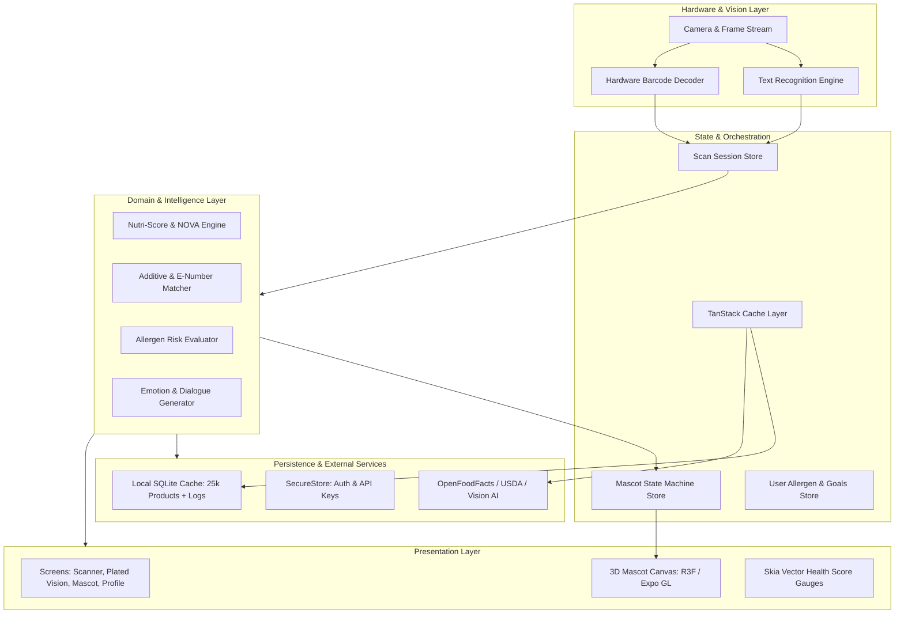

# System Architecture & Technical Specifications (ARCHITECTURE.md) — NutriBuddy

**Version:** 1.0.0  
**Stack:** React Native (Expo SDK 51+), TypeScript (Strict), Three.js / R3F, SQLite, Zustand, TanStack Query  

---

## 1. High-Level Architecture

NutriBuddy is engineered with a modular, offline-first client architecture. The application is divided into five cohesive layers:
1. **Presentation & View Layer:** React Native screens, fluid gesture interfaces, Skia vector graphics, and 3D Canvas mascot rendering.
2. **State & Orchestration Layer:** Zustand global stores for application state, active scan sessions, user preferences, and TanStack Query for remote server state.
3. **Computer Vision & Hardware Layer:** Camera frame acquisition, barcode scanning, OCR text extraction, and on-device image preprocessing.
4. **Domain & Business Logic Layer:** Additive classification, allergen screening, NOVA classification, and the NutriBuddy Health Index scoring engine.
5. **Persistence & Gateway Layer:** Local SQLite database, secure key-value storage, and resilient external API clients (OpenFoodFacts, USDA, Vision LLM).



---

## 2. Technology Stack & Key Dependencies

| Domain | Selected Technology | Rationale & Tradeoffs |
|---|---|---|
| **Core Framework** | React Native (Expo SDK 51+) | Cross-platform parity, rapid iteration, robust EAS native builds, modern custom config plugins. |
| **Language** | TypeScript 5.4+ (Strict Mode) | Full type-safety, zero implicit `any`, runtime safety when parsing complex nutritional payloads. |
| **State Management** | Zustand 4.5+ | Ultra-lightweight (1KB), boilerplate-free, seamless persistence middleware, performant outside React tree. |
| **Server State & Cache** | TanStack React Query v5 | Automatic deduplication, stale-while-revalidate, retry strategies, and offline query hydration. |
| **3D Mascot Rendering** | `@react-three/fiber` + `three` | Industry-standard declarative WebGL/Three.js integration on Expo GL canvas with GLTF/GLB support. |
| **Animations & Gestures** | `react-native-reanimated` 3.x + `react-native-gesture-handler` | 60/120 FPS UI thread execution, fluid spring physics, interactive dragging, and smooth score interpolation. |
| **Vector Graphics & Charts** | `@shopify/react-native-skia` | High-performance 2D hardware-accelerated drawing for custom circular health score gauges and nutrition graphs. |
| **Camera & Scanning** | `expo-camera` / Barcode Scanner | Stable native bridge for iOS AVFoundation and Android CameraX, fast hardware barcode detection. |
| **Local Offline Database**| `expo-sqlite` (next-gen API) | High-throughput relational storage for pre-bundled offline additive index and user scan histories. |
| **Sensory Feedback** | `expo-haptics` + `expo-av` | Tactile and acoustic confirmation for scan events and mascot emotional reactions. |

---

## 3. Data Flow Pipelines

### 3.1. Packaged Food Ingestion Pipeline
1. **Frame Capture / Barcode Trigger:** Camera detects barcode (EAN-13, UPC).
2. **Multi-Tier Cache Lookup:**
   - Level 1: In-Memory LRU Cache (Instant, 0ms).
   - Level 2: Local SQLite DB (`products` table, <5ms).
   - Level 3: Remote Network (`OpenFoodFacts` v2 API, ~300ms).
3. **Fallback to OCR:** If barcode is absent or not in database, user points at ingredient panel. OCR extracts text string.
4. **Tokenization & Cleaning:** Regex normalizes text (strips legal disclaimers, parses percentages and parenthetical sub-lists).
5. **Additive & Allergen Evaluation:** Matches tokens against the 2,500+ record additive table and user's allergen blacklist.
6. **Nutri-Score & NOVA Calculation:** Compute score (0–100) and assign Grade (A–F).
7. **Mascot Trigger:** Emit new emotion state to `MascotStateStore`.

### 3.2. Live Food Vision Pipeline
1. **Snapshot Acquisition:** User frames plate and taps capture button.
2. **Compression & Sizing:** Image is cropped to 1080x1080, compressed to JPEG (~250KB) to minimize payload size.
3. **Inference Request:** Sent to Vision AI endpoint with strict JSON schema definition.
4. **Response Parsing & Validation:** Zod validator parses items, calories, macro splits, and bounding box coordinates.
5. **UI Annotation:** Bounding box coordinates are mapped onto screen dimensions; animated chips pop up over the food image.
6. **Mascot Evaluation:** Mascot reviews meal balance (protein vs. glycemic density) and speaks an encouraging reaction.

---

## 4. Core TypeScript Data Models

### 4.1. Nutritional & Product Schemas
```typescript
export type NovaGroup = 1 | 2 | 3 | 4;
export type HealthGrade = 'A' | 'B' | 'C' | 'D' | 'F';
export type AdditiveRiskTier = 'safe' | 'caution' | 'high_risk';

export interface AdditiveInfo {
  code: string;           // e.g., "E211" or "Sodium Benzoate"
  name: string;
  riskTier: AdditiveRiskTier;
  description: string;
  concerns: string[];     // e.g., ["Hyperactivity in children", "Forms benzene"]
}

export interface MacroNutrients {
  calories: number;       // kcal
  protein: number;        // grams
  carbohydrates: number;  // grams
  sugars: number;         // grams
  addedSugars?: number;   // grams
  fat: number;            // grams
  saturatedFat: number;   // grams
  fiber: number;          // grams
  sodium: number;         // milligrams
}

export interface ScannedProduct {
  id: string;
  barcode?: string;
  name: string;
  brand?: string;
  imageUrl?: string;
  servingSize: string;
  macrosPer100g: MacroNutrients;
  ingredientsText: string;
  parsedIngredients: string[];
  additivesDetected: AdditiveInfo[];
  flaggedAllergens: string[];
  novaGroup: NovaGroup;
  healthScore: number;    // 0 to 100
  grade: HealthGrade;
  createdAt: number;
}
```

### 4.2. Live Food Plate Schema
```typescript
export interface PlatedFoodItem {
  id: string;
  name: string;
  estimatedGrams: number;
  macros: MacroNutrients;
  confidence: number;     // 0.00 to 1.00
  boundingBox?: {
    x: number;            // percentage 0 - 100
    y: number;
    width: number;
    height: number;
  };
}

export interface LiveMealScanResult {
  id: string;
  imageUri: string;
  items: PlatedFoodItem[];
  totalMacros: MacroNutrients;
  overallHealthScore: number;
  healthGrade: HealthGrade;
  dietaryHighlights: string[];
  mascotReactionText: string;
  timestamp: number;
}
```

### 4.3. Mascot Emotion State Schema
```typescript
export type MascotMood = 'ecstatic' | 'happy' | 'neutral' | 'concerned' | 'alarmed' | 'sleepy';

export interface MascotState {
  currentMood: MascotMood;
  activeAnimation: string;
  dialogueText: string;
  isInteracting: boolean;
  soundCue?: string;
  lastFedTimestamp: number;
  dailyStreak: number;
}
```

---

## 5. Offline Storage & Caching Architecture

### 5.1. SQLite Database Schema
The local database `nutribuddy.db` contains:
```sql
CREATE TABLE IF NOT EXISTS cached_products (
  barcode TEXT PRIMARY KEY,
  name TEXT NOT NULL,
  brand TEXT,
  health_score INTEGER NOT NULL,
  grade TEXT NOT NULL,
  nova_group INTEGER NOT NULL,
  data_json TEXT NOT NULL,
  updated_at INTEGER NOT NULL
);

CREATE TABLE IF NOT EXISTS scan_history (
  id TEXT PRIMARY KEY,
  scan_type TEXT NOT NULL, -- 'barcode', 'ocr', 'live_plate'
  title TEXT NOT NULL,
  health_score INTEGER NOT NULL,
  payload_json TEXT NOT NULL,
  created_at INTEGER NOT NULL
);

CREATE TABLE IF NOT EXISTS additives_reference (
  code TEXT PRIMARY KEY,
  name TEXT NOT NULL,
  risk_tier TEXT NOT NULL,
  description TEXT NOT NULL
);
```

### 5.2. Memory Cache & Eviction Policy
- High-priority in-memory LRU cache stores up to 200 recent food scans.
- SQLite acts as persistent secondary cache (up to 5,000 items with LRU eviction when database exceeds 50MB).

---

## 6. Security, Privacy & Device Resource Safeguards

1. **Ephemeral Image Handling:** Frames sent to cloud vision endpoints are transmitted as temporary base64/binary payloads and never saved on third-party servers permanently.
2. **Thermal & Battery Management:**
   - 3D Mascot framerate automatically drops from 60 FPS to 30 FPS if device battery state indicates Low Power Mode or device thermal status exceeds normal limits.
   - Camera preview stops rendering and sensor streams disconnect immediately when navigating away from the scanner screen.
3. **Secure Storage:** API keys and user authentication tokens are stored exclusively via `expo-secure-store` backed by iOS Keychain and Android Keystore.
